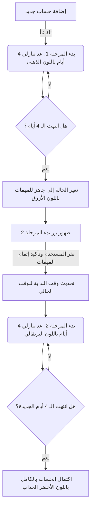

# ⏱️ وقتك | Waqtak — Bybit Account Tracker

**وقتك (Waqtak)** هو تطبيق ويب متطور، ذكي وآمن بالكامل، مصمم خصيصاً لمتابعة حسابات وتتبع فترات المراجعة والجاهزية لإيداعات منصة Bybit خطوة بخطوة. يتميز التطبيق بواجهة مستخدم زجاجية عصرية (Glassmorphic UI) تفاعلية بالكامل، تدعم اللغتين العربية والإنجليزية ديناميكياً وتعمل بالكامل على جانب العميل (Client-Side) لضمان خصوصية وأمان البيانات بنسبة 100%.

---

## 📖 جدول المحتويات / Table of Contents
* [الميزات الرئيسية / Key Features](#-الميزات-الرئيسية--key-features)
* [أنماط التشغيل / Operational Modes](#-أنماط-التشغيل--operational-modes)
* [هيكلية البيانات والتخزين الثنائي / Data Architecture & Dual Storage](#-هيكلية-البيانات-والتخزين-الثنائي--data-architecture--dual-storage)
* [التكنولوجيا المستخدمة / Tech Stack](#-التكنولوجيا-المستخدمة--tech-stack)
* [دليل التثبيت والتشغيل / Installation & Setup](#-دليل-التثبيت-والتشغيل--installation--setup)
* [دورة حياة الحساب / Account Lifecycle](#-دورة-حياة-الحساب--account-lifecycle)

---

## 🚀 الميزات الرئيسية / Key Features

### 1. 🔔 نظام الإشعارات الذكي (Browser Notifications)
* يرسل تنبيهات فورية لسطح المكتب أو الهاتف عند انتهاء المرحلة الأولى (جاهز للمهمات) وعند اكتمال المرحلة الثانية (جاهز بالكامل).
* يقوم بجدولة الإشعارات المستقبلية تلقائياً لكل حساب.
* يتحقق عند فتح التطبيق من أي إشعارات فائتة (انتهت مؤقتاتها أثناء إغلاق الصفحة) ويرسلها فوراً للمستخدم.

### 2. 🛡️ التخزين الثنائي المحمي (Dual Storage Backup)
* لحماية البيانات من الحذف المفاجئ في حال مسح كاش المتصفح (Browser Cache)، يقوم التطبيق بحفظ الحسابات في مسارين منفصلين تزامناً:
  1. **`localStorage`**: للتحميل الفوري والسريع للبيانات.
  2. **`IndexedDB`**: قاعدة بيانات متصفح محلية عميقة ومنفصلة تماماً.
* في حال فقدان بيانات الـ LocalStorage لأي سبب، يتعرف التطبيق على ذلك تلقائياً ويسترد كامل البيانات من الـ IndexedDB فوراً ويعرض تنبيهاً بالاستعادة الناجحة.

### 3. 📊 لوحة الإحصائيات (Stats Dashboard)
* ملخص لحظي لكافة الحسابات يوضح:
  * إجمالي عدد الحسابات المضافة.
  * الحسابات النشطة في المرحلة 1 والمرحلة 2.
  * الحسابات المكتملة كلياً.
  * **إجمالي مبالغ الإيداع الكلي** منسقاً حسب لغة الواجهة.
  * عدد الحسابات التي ستنتهي **اليوم** (المتبقي لها أقل من 24 ساعة).

### 4. 💾 تصدير واستيراد البيانات (JSON Backup & Restore)
* **التصدير**: بضغطة زر، يمكنك تحميل ملف `.json` احتياطي يحمل الاسم والتوقيت الحالي للحفاظ على نسخة ملموسة من بياناتك على جهازك.
* **الاستيراد**: إمكانية رفع ملف النسخة الاحتياطية لاستعادة الحسابات وسجلاتها التاريخية كاملة على أي جهاز آخر.

### 5. 🏷️ التصفية والفرز المتقدم (Filtering & Sorting)
* فلاتر مخصصة لعرض الحسابات حسب حالتها: (الكل / المرحلة 1 / المرحلة 2 / مكتمل).
* فرز مرن للحسابات حسب: (الأحدث إيداعاً / الأقدم إيداعاً / الأقرب للانتهاء) لتركيز الاهتمام على الحسابات العاجلة.

### 6. 📋 أزرز النسخ السريع والعمليات (Quick Action Controls)
* زر نسخ سريع بجانب كل من الـ UID، البريد الإلكتروني، وعنوان الـ IP لتسهيل العمل دون تظليل يدوي.
* سجل تغييرات تاريخي (Audit Log) مدمج في كل بطاقة يوضح تاريخ الإنشاء، التعديل، والانتقال للمراحل بالتوقيت الدقيق.

---

## 💻 أنماط التشغيل / Operational Modes

### 1. الحاسبة السريعة (Quick Calculator Mode)
* مخصصة لحساب فترات الـ 4 أيام والـ 8 أيام بشكل فوري لحساب واحد دون حفظه في لوحة الإدارة.
* تدعم 3 طرق لإدخال التاريخ:
  * **تنسيق UTC**: مثل لصق تاريخ Bybit المباشر `2026-05-26 11:36:42 (UTC+0)`.
  * **تنسيق بريد Gmail**: مثل لصق `May 26, 2026, 2:36 PM` ويتم معالجته وتوطينه تلقائياً.
  * **تنسيق يدوي**: اختيار التاريخ والوقت عبر منتقي التاريخ المدمج بالتوقيت المحلي لمصر.

### 2. مدير الحسابات الذكي (Account Manager Notepad)
* مفكرة ذكية لإدارة حسابات متعددة مع إدخال البيانات المرافقة (UID, Email, IP, Amount, Notes).
* زر **"الآن ⏱️"** لتعبئة الوقت الحالي للمستخدم تلقائياً.
* مؤقتات عد تنازلي حية تعمل في الخلفية لكل بطاقة حساب على حدة وتتفاعل ألوانها وقيمها ثانية بثانية.

---

## ⚙️ هيكلية البيانات والتخزين الثنائي / Data Architecture & Dual Storage

يتم تمثيل كل حساب داخل الكود بالهيكل البرمجي التالي لضمان تتبع دقيق لكافة الحالات والتغييرات:

```json
{
  "id": 1784191780306,
  "uid": "87654321",
  "email": "user@example.com",
  "ip": "192.168.1.50",
  "amount": "250",
  "notes": "تم تفعيل الحساب بنجاح",
  "depositTime": "2026-07-16T08:30:00.000Z",
  "stage": 1,
  "stage2StartTime": null,
  "auditLog": [
    { "action": "created", "time": "2026-07-16T08:30:05.123Z" },
    { "action": "edited", "time": "2026-07-16T09:12:00.456Z" }
  ],
  "notif1Sent": false,
  "notif2Sent": false
}
```

---

## 🛠️ التكنولوجيا المستخدمة / Tech Stack

* **Structure**: HTML5 (Semantic Elements)
* **Styling**: Vanilla CSS3 (Custom Variables, Flexbox, CSS Grid, Glassmorphism, Backdrop Filters)
* **Logic**: Vanilla JavaScript (ES6+, Promises, Async/Await)
* **APIs**:
  * **IndexedDB API**: للتخزين الاحتياطي المحلي طويل المدى.
  * **Web Notifications API**: لإرسال الإشعارات وتنبيهات النظام.
  * **Clipboard API**: للنسخ السريع بنقرة زر.

---

## ⏳ دورة حياة الحساب / Account Lifecycle



---

## 📦 دليل التثبيت والتشغيل / Installation & Setup

1. قم بعمل Clone للمستودع:
   ```bash
   git clone https://github.com/zeyadmohamed2610/Waqtak.git
   ```
2. افتح مجلد المشروع:
   ```bash
   cd Waqtak
   ```
3. قم بتشغيل ملف `index.html` مباشرة في أي متصفح، أو ارفعه على أي منصة استضافة ثابتة مثل **Vercel** أو **GitHub Pages**.

---

### 🌐 الخصوصية والأمان
لا يقوم تطبيق **وقتك** بإرسال أي بيانات إلى أي سيرفر خارجي. جميع العمليات، التواريخ، التنبيهات، والنسخ الاحتياطية تتم وتُحفظ محلياً 100% داخل متصفحك الخاص، مما يمنحك أماناً مطلقاً لحماية خصوصية حساباتك وبياناتك المالية.
